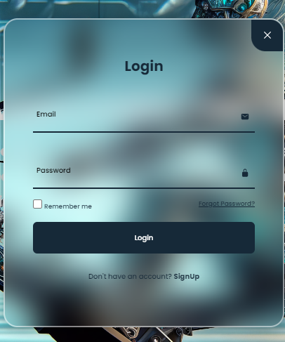
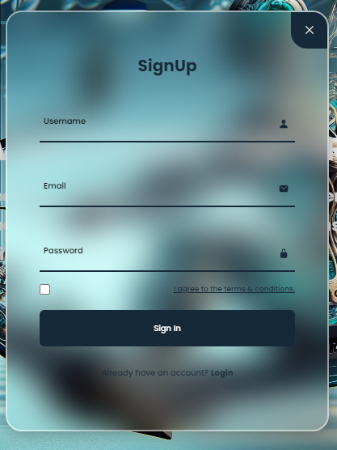
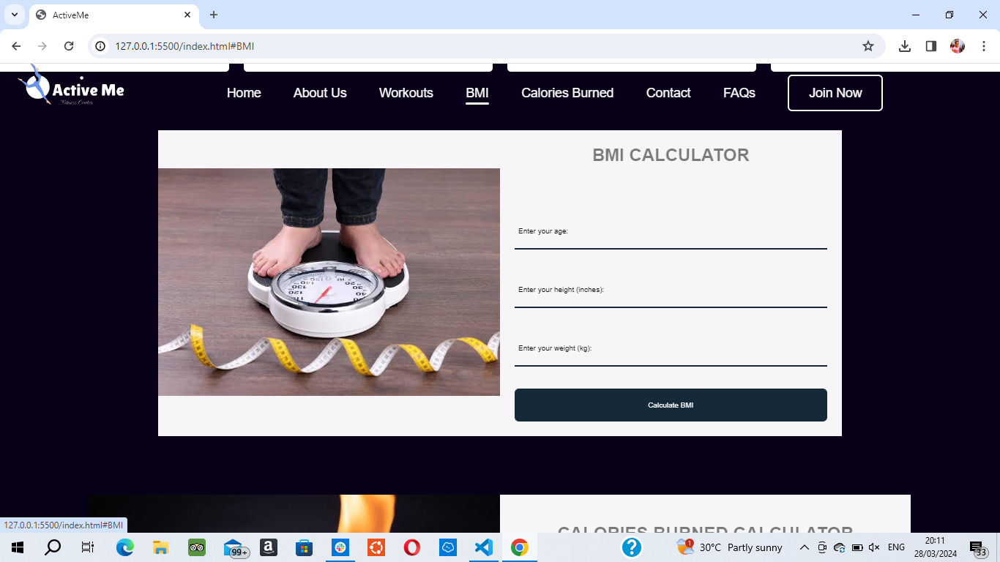
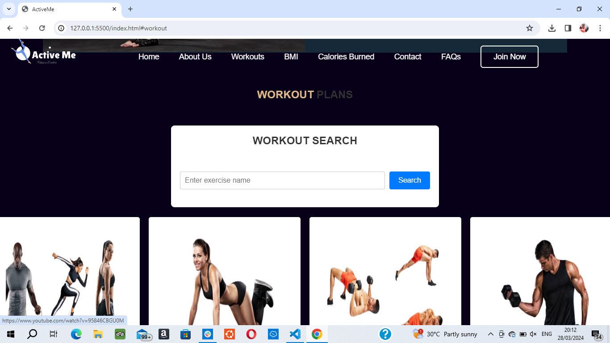
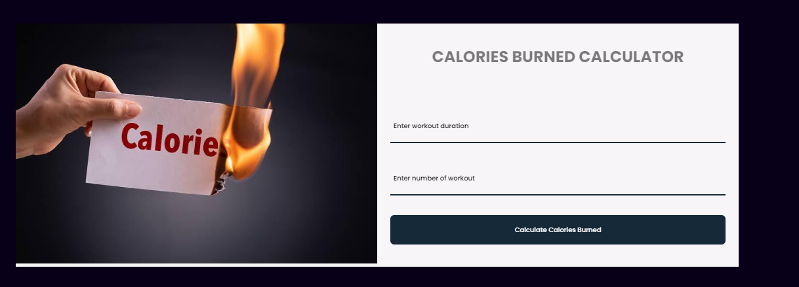

# ACTIVEME fitness center

ActiveMe is a fitness website designed for individuals to conveniently workout from home. It offers a range of features including home workouts, a BMI calculator, a calorie burned calculator, workout videos, and more to help you achieve your fitness goals.

## Features of ACTIVEME

- Body Mass Index(BMI) Calculator
The BMI calculator on ActiveMe allows you to input your height and weight to calculate your Body Mass Index (BMI), providing an estimate of your body fat based on these measurements.

- Workouts
 ActiveMe provides workout videos tailored for various fitness levels, from beginners to advanced users. You can choose workouts that match your fitness level and gradually progress as you improve.

- Calories Burned Calculator
The Calorie Burned Calculator helps you estimate the number of calories you burn during various activities or workouts by inputting the duration and the workout done.

Getting started with ActiveMe is simple! Explore the various features on the website, choose a workout video that suits your fitness level and goals, use the calculators to track your progress, and embark on an exciting fitness journey from the comfort of your home!